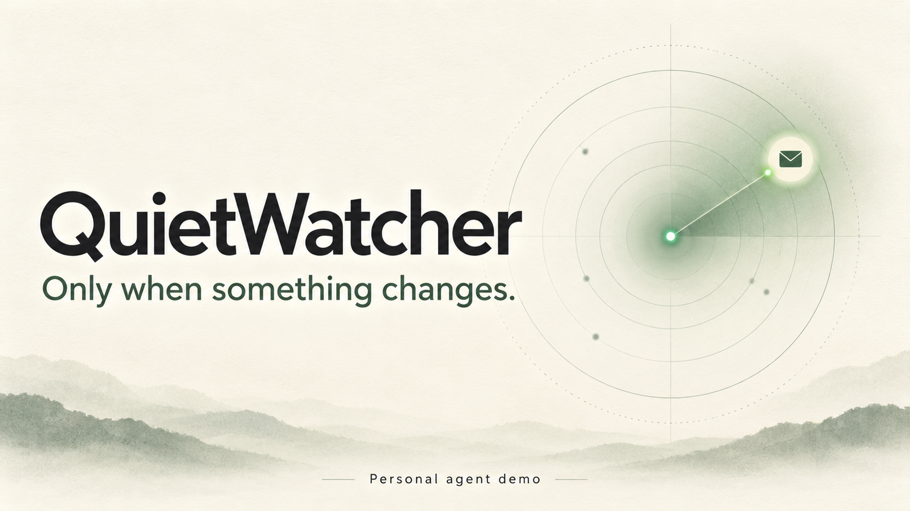
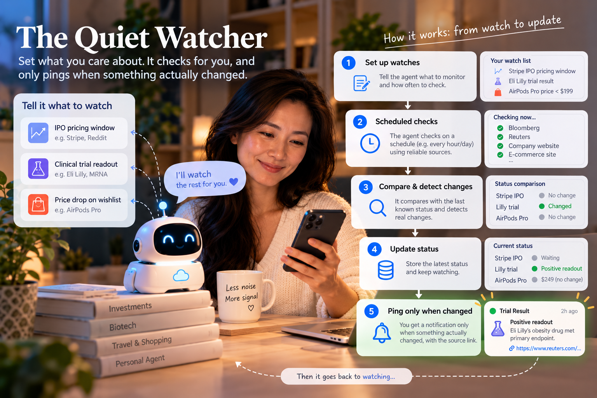

# QuietWatcher
## Demo Video
*Small demo video due to the file size limit of GitHub*
[](https://github.com/user-attachments/assets/42c23e2f-acc8-45bc-9a43-3df3ba30a769)

*Click the image below to watch the narrated demo on YouTube.*
[](https://youtu.be/nks75ngRzF8)

QuietWatcher checks things you care about on a schedule and emails you only when their meaningful state changes. Each alert includes the source link that supports the change. You never need to watch the dashboard. AgentEmail is the interface; the UI is for setup and debugging.



## Installed agent skills

The following skills are available in `.agents/skills/`:

| Area | Installed skills |
| --- | --- |
| Neon | `neon`, `neon-postgres`, `neon-object-storage`, `neon-ai-gateway`, `neon-functions` |
| Mastra | `mastra`, `mastra-factory` |
| Exa | `build-with-exa`, `exa-search`, `exa-contents` |
| AgentMail | `agentmail`, `agentmail-toolkit`, `agentmail-send-email`, `agentmail-check-email`, `agentmail-manage-inboxes`, `agentmail-mcp`, `agentmail-cli` |

## Stack and data flow

- **Exa** searches the web and returns structured observations with source results.
- **Neon Postgres** stores each watch's last-known state, meaningful observations, and a durable email outbox.
- **Mastra** runs the monitor as a workflow on a one-minute cron and provides workflow/run logging. Each watch's `check_interval_minutes` controls when it is due.
- **AgentMail** sends an email only after the workflow recognizes a qualifying state transition. The alert includes a link to its Exa result.

The workflow is deliberately conservative after search: it compares normalized state fields (`value`, `status`, and `eventDate`) rather than summaries. Each watch pins the source URL and domain from its baseline; future searches are restricted to the domain and must return that exact page. Price observations are numeric `{ "amount": 39.99, "currency": "USD" }` values; the target has an explicit currency too. A price change must be below both the previous amount and the configured target, have matching currencies, meet the 0.8 extraction-confidence threshold, and appear in two consecutive observations from the pinned page before an alert is sent. The first successful check sets the baseline without emailing.

### How an Exa result becomes `{value, status, eventDate}`

For each due watch, QuietWatcher sends the watch's query to Exa with the structured output schema in `src/state.js` and an extraction prompt from `src/workflow.js`. Exa uses the returned source-page content to produce `value`, `status`, `summary`, `event_date`, and a confidence score between 0 and 1. For price watches, `value` is a numeric amount and ISO 4217 currency object; other watch kinds use a canonical string. The prompt requests explicit facts only, stable values, and an empty `event_date` when the date is unknown.

`parseExaObservation` validates the structured response and maps `event_date` to the application's camel-case `eventDate`. It requires non-empty `status` and `summary`, the correct value shape for the watch kind, and a valid confidence score. An observation below 0.8 is ignored and does not change the baseline. For example, a source that explicitly lists a product at $39.99 and says it is available could yield:

```json
{
  "value": { "amount": 39.99, "currency": "USD" },
  "status": "available",
  "summary": "The listed price is $39.99.",
  "eventDate": "",
  "confidence": 0.98
}
```

The workflow keeps the observation separate from its citation: it selects a valid HTTP(S) result matching the watch's pinned URL and stores that result's URL and title beside the parsed state. It fingerprints `value`, `status`, and `eventDate`; changes to the summary or search-result ordering alone do not count. Empty searches, search errors, invalid structured output, and low-confidence results are not observations and never replace `current_state`. Existing watches are rebased once after the migration if they have no source pin; older price states are also rebased once into the numeric amount/currency shape.

## Data model

The schema migrations are [`db/migrations/0001_initial_schema.sql`](db/migrations/0001_initial_schema.sql) and [`db/migrations/0002_source_confirmation.sql`](db/migrations/0002_source_confirmation.sql):

- `quiet_watcher.watches`: query, watch kind, criteria, recipient, check interval, last-known state, pinned source URL/domain, and an unconfirmed candidate state.
- `quiet_watcher.observations`: each new normalized state, its summary, and its source URL.
- `quiet_watcher.alert_outbox`: pending/sent email records, with retry metadata and a stable AgentMail idempotency key.

Apply both migrations to the database with a **direct, non-pooled** connection, in order, then use the pooled `DATABASE_URL` for the application. For example, with `psql` installed:

```powershell
$env:PGPASSWORD = "<password from your direct connection string>"
psql "<direct connection string>" -f db/migrations/0001_initial_schema.sql
psql "<direct connection string>" -f db/migrations/0002_source_confirmation.sql
```

Add a watch after applying the migration. This example starts with a known baseline so that a later drop can be detected:

```sql
INSERT INTO quiet_watcher.watches
  (name, kind, query, criteria, recipient_email, check_interval_minutes, current_state)
VALUES
  (
    'Headphones price',
    'price_drop',
    'Current price for Acme Quiet headphones; prefer retailer product pages and include the listed price',
    '{"targetPrice": 100, "targetCurrency": "USD"}'::jsonb,
    'you@example.com',
    15,
    '{"value":{"amount":129.99,"currency":"USD"},"status":"available","summary":"Baseline price","eventDate":"","confidence":0.99}'::jsonb
  );
```

For `ipo_pricing_window` and `clinical_trial_readout`, set `criteria.alertStatuses` to the relevant statuses (for example `["priced"]` or `["readout"]`). Use precise queries and trustworthy source preferences in the query text; don't treat a search result alone as a confirmed change.

## Demo and tests

The demo uses a deterministic in-memory watch store, mocked Exa result, and captured mail adapter. It does not require API keys or send a real email.

```powershell
npm run demo
npm test
```

The demo starts with a $59.99 baseline, observes a drop to $39.99 against a $45 target, and verifies that the single notification contains a source URL. It then checks the unchanged price again and verifies that no duplicate email is sent.

## Run against live services

Copy `.env.example` to `.env` and fill in:

- `EXA_API_KEY`: Exa API key.
- `DATABASE_URL`: pooled Neon Postgres connection string for app queries.
- `AGENTMAIL_API_KEY`: AgentMail API key.
- `AGENTMAIL_INBOX_ID`: existing AgentMail inbox used to send alerts. Create/select an inbox through AgentMail before starting the worker.

Then start the scheduled worker:

```powershell
npm start
```

This starts the web UI at `http://localhost:4173` and the Mastra scheduler. The server loads `.env` from the project root regardless of the shell's current directory. Restart it after changing credentials. In live mode, adding a watch sends a confirmation with its monitoring details to user specified email address (in this project, we use `quietwatch@agentmail.to`); demo mode sends no real email. Create and manage watches in the UI; the first check sets a baseline. The scheduler polls for due watches every minute, while `next_check_at` enforces each watch's interval. Keep the process running for scheduled checks.

With no credentials configured, `npm start` opens the UI in demo mode. The sample watch and captured email are in memory only; no actual email is sent. If only some live credentials are set, the UI indicates which ones remain instead of silently switching to demo mode.

The **Check now** button runs the same Mastra workflow immediately. The dashboard shows its three stages, checks, saved observations, and source links. In demo mode the check simulates a price drop and displays the captured notification in Recent activity.

## Project plan

1. **MVP workflow and price-drop demo — implemented.** Define the Postgres model; create a Mastra scheduled workflow; connect Exa search, state comparison, and an AgentMail outbox; prove source-linked notification and unchanged-state silence with offline tests.
2. **Live watch setup.** Apply the migration, configure service credentials, create an inbox and one watch, then verify a real search result and a delivered email. Keep the first live test pointed at a low-risk, public product-price query.
3. **Event-specific rules.** Add and test precise extraction/transition rules for IPO pricing windows and clinical-trial readouts. Tune each watch's accepted statuses and baseline so only a new, supported event qualifies.
4. **Reliability and operations.** Add retry/backoff policy, stale-source handling, rate/cost limits, alert delivery health, and multi-worker concurrency tests. Configure a Mastra Platform exporter only if hosted trace retention is wanted, otherwise, the MVP doesn't require a UI or hosted observability account.

Tested end to end on localhost with live Exa, Neon, and AgentMail services. Bring your own credentials to run it.
>>>>>>> 67c4a27 (Import QuietWatcher project)
